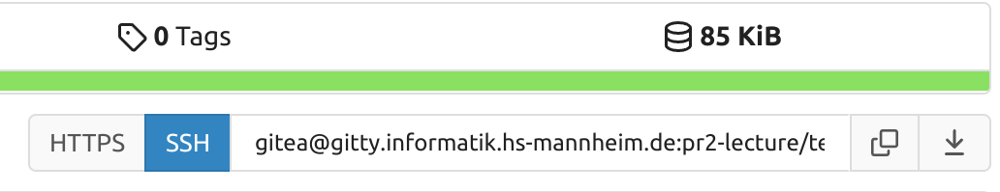

# Umgebung aufsetzen

**🎓 Benotetes Assignment 🎓**

📆 **Fällig: 01.10.2025** 📆

## Lernziel

Umgebung für die Vorlesung aufsetzen.

## Beschreibung

In diesem Assignment werden Sie die notwendige Tool-Umgebung für die Bearbeitung der Aufgaben aus der Vorlesung aufsetzen.

Die Abgabe der Aufgaben und die Tests sind automatisiert, sodass Sie auf jeden Fall die passenden Werkzeuge installieren müssen, damit Sie die Übungen durchführen können. Bitte halten Sie sich an die folgenden Anweisungen und nehmen Sie keine "Abkürzungen".

## Softwareausstattung

### Linux

Wenn Sie einen eigenen Rechner für die Veranstaltung verwenden wollen -- was dringend zu empfehlen ist, installieren Sie bitte (direkt auf dem Gerät oder in einer VM) ein **64-Bit Ubuntu Linux** in einer aktuellen Version (z.B. 24.04). Eine Anleitung und Unterstützung finden Sie [hier](https://github.com/informatik-mannheim/linux-hsma/blob/main/ubuntu/doc/readme.md). Die Anleitung ist umfangreich und beschreibt, wie Sie ein vollständiges System aufsetzen. Wenn Sie Linux in einer VM betreiben, können Sie sich das vollständige Setup sparen und nur ein grundlegendes System installieren.

Wenn Sie ein anderes Linux verwenden wollen, prüfen Sie vorher, ob es für dieses ein JDK 21 gibt. Mit Ubuntu 24.04 sind Sie auf der sicheren Seite.

Bitte versuchen Sie nicht, die Übungen ohne Linux zu lösen, es wartet eine Welt der Frustration und des Schmerzes 😭 auf Sie, durch die schon viele andere gegangen sind, die diesen einen wichtigen Tipp ignoriert haben.

### Programme

Bevor Sie Programme installieren, sollten Sie vorweg einmal das Kommando `sudo apt update` ausführen. Mit `sudo apt upgrade` halten Sie Ihr System jederzeit aktuell.

Nachdem Sie Linux installiert haben, fügen Sie die folgende Software in mindestens der angegebenen Version hinzu:

  * **Java JDK 21**<br>`sudo apt install openjdk-21-jdk openjdk-21-source openjdk-21-doc`
  * **Git** und Git-Frontends<br>`sudo apt install git meld git-cola`
  * **Maven 3.8 oder neuer**<br>`sudo apt install maven`
  * **Eclipse**<br>Von der [Webseite](https://www.eclipse.org/downloads/) herunterladen und installieren. Bitte verwenden Sie die neueste Version von **Eclipse IDE for Java Developers**

## Aufsetzen der Arbeitsumgebung

### Setup von Git

Setzen Sie bei Git die notwendigen Nutzerinformationen, über die passenden Kommandos:

```console
$ git config --global user.name "Mona Lisa"
$ git config --global user.email "mona.lisa@louvre.fr"
```

_Benutzen Sie bitte Ihren Namen und Ihre HS-Mannheim-E-Mail-Adresse. Jede Abgabe als Mona Lisa wird mit Punktabzug bestraft_!

Nun sollten Sie noch die Merge-Strategie konfigurieren. Damit teilen Sie Git mit, wie Änderungen zusammengeführt werden sollen.

```console
$ git config --global pull.rebase false
```

### ssh-Key erzeugen

Damit Sie Ihre Abgaben automatisiert durchführen können und nicht immer wieder Ihren Benutzernamen und Ihr Passwort eingeben müssen, erzeugen Sie sich einen SSH-Key. `hugo` müssen Sie durch Ihren wirklichen Benutzernamen ersetzen,

```console
$ mkdir -p ~/.ssh
$ chmod og-rwx ~/.ssh
$ ssh-keygen
Generating public/private rsa key pair.
Enter file in which to save the key (/home/hugo/.ssh/id_rsa): ⏎
Enter passphrase (empty for no passphrase): ⏎
Enter same passphrase again: ⏎
Your identification has been saved in /home/hugo/.ssh/id_rsa
Your public key has been saved in /home/hugo/.ssh/id_rsa.pub
The key fingerprint is:
SHA256:jnxRiAreSWFBlHP3zOzggy9YIhd8T+A5AFBA2f8ioKQ hugo@meinrechnername
The key's randomart image is:
+---[RSA 3072]----+
|+==+*o           |
| . o+.o...       |
|  ..o=.+.=.      |
| + +o+= o.=      |
|+ o +o.*So       |
|E ..ooo++..      |
|   o.++.o.       |
|    . ...        |
|       .         |
+----[SHA256]-----+
```

Der ssh-Key liegen jetzt im Verzeichnis `.ssh` in Ihrem Home-Directory. Im Beispiel haben wir den Default-Namen `id_rsa` für den Key verwendet. Sie finden in dem Verzeichnis jetzt mindestens zwei Dateien:

  * `id_rsa` für den Secret-Key
  * `id_rsa.pub` für den Public-Key

Haben Sie einen anderen Namen angegeben, dann heißen die Schlüssel natürlich entsprechend anders. In diesem Fall kann es auch nötig sein, den Schlüssel `ssh` erst bekannt zu machen.

Den __Public-Key__ müssen Sie dann auf dem Git-Server hinterlegen.

  1. Öffnen Sie die URL `https://gitty.informatik.hs-mannheim.de` und melden Sie sich mit Ihrem Hochschulaccount an
  2. Gehen Sie auf Ihren Nutzer, dann auf "Settings" und danach auch "SSH/GPG Keys".
  3. Fügen Sie über den Knopf _Add Key_ den **Public Key** des soeben erzeugten Schlüssels hinzu, also den Inhalt der Datei `.ssh/id_rsa.pub`.
  4. Testen Sie den Schlüssel:
     * Falls Sie nicht an der Hochschule sind, bauen Sie eine VPN-Verbindung auf, damit Sie sich im Netz der Hochschule befinden
     * Öffnen Sie eine Konsole
     * Geben Sie `ssh gitea@gitty.informatik.hs-mannheim.de` ein.
     * Sie sollten die Meldung bekommen, mit welchem Schlüssel Sie sich authentifiziert haben.

```console
$ ssh gitea@gitty.informatik.hs-mannheim.de
Hi there, hugo! You've successfully authenticated with the key named hugo@meinrechnername, but Gitea does not provide shell access.
If this is unexpected, please log in with password and setup Gitea under another user.
Connection to gitty.informatik.hs-mannheim.de closed.
```

### Repository

Alle Ihre Abgaben erfolgen über ein Ihnen zugeordnetes Repository. Dieses Repository werden anhand der Gruppen angelegt, in die Sie sich eingetragen haben. Sobald es für Sie erzeugt wurde, sollte es Ihnen nach dem Login angezeigt werden, wenn Sie in die [Organisation pr2-lecture](https://gitty.informatik.hs-mannheim.de/pr2-lecture) gehen. (Sollten Sie einen `Fehler 404` bekommen, haben Sie vergessen sich auf der Webseite anzumelden.)

Gehen Sie auf Ihre Repository und kopieren Sie sich die "Clone URL" für ssh:



**Achtung:** Verwenden Sie **nicht** die https-URL.


### Working Directory

Suchen Sie sich auf Ihrem Rechner eine Stelle, an der Sie in Zukunft alle Quelltexte und Aufgaben für PR2 bearbeiten wollen (__Working Directory__). Wir gehen im Folgenden davon aus, dass Sie einfach innerhalb von `~/Documents` arbeiten. Verwenden Sie keinen Dropbox-, Google- oder OneDrive-Ordner, weil diese häufig zu Problemen im Zusammenhang mit Git führen.

Öffnen Sie das Working Directory in einer Konsole und clonen Sie Ihr Git-Repository mit der URL, die Sie im vorhergehenden Schritt ausgelesen haben. Hier als Beispiel für `team-01`.

```console
$ git clone gitea@gitty.informatik.hs-mannheim.de:pr2-lecture/team-01.git
$ cd team-01/
```

In dem Verzeichnis sollten bereits ein paar Dateien vorhanden sein, insbesondere ein Ordner `bin`.

### Aktuelle Aufgaben holen

Im Ordner `bin` Ihres Working Directory finden Sie zwei Skripte:

  * `update.sh`: Aktualisiert Ihr Verzeichnis und holt die aktuellen Aufgaben.
  * `submit.sh`: Reicht Ihre Lösungen ein.

Holen Sie nun die aktuellen Aufgaben, indem Sie das `update.sh`-Skript ausführen.

Führen Sie das Skript aus dem Arbeitsverzeichnis mit `bin/update.sh` aus und gehen Sie **nicht** in den `bin`-Ordner.

```console
$ bin/update.sh
Cloning into '.assignments'...
remote: Enumerating objects: 142, done.
remote: Counting objects: 100% (15/15), done.
remote: Compressing objects: 100% (12/12), done.
remote: Total 142 (delta 0), reused 0 (delta 0), pack-reused 127
Receiving objects: 100% (142/142), 56.99 KiB | 3.00 MiB/s, done.
Resolving deltas: 100% (59/59), done.
---------------------------------------------------------------
Hole neue Aufgaben und Quelltexte
---------------------------------------------------------------
From gitty.informatik.hs-mannheim.de:pr2-lecture/assignments
 * branch            master     -> FETCH_HEAD
Already up to date.
```

Sie sehen jetzt folgende Dateien und Ordner in Ihrem Verzeichnis (Anzeige mit `ls -axl`):

  * `.assignments` - Arbeitsverzeichnis für das Laden der Aufgaben
  * `.git` - Arbeitsverzeichnis für GIT
  * `.gitignore` - Konfiguration für GIT
  * `bin` - Skripte
  * `Assignment_xx` - einzelne Aufgaben
  * `README.md` - Überblick über alle Aufgaben
  * `sources` - Quelltexte

Wenn Sie bei dem Versuch das Skript zu starten, die **Fehlermeldung** `cannot execute: required file not found` bekommen, ist Ihre `bash` an einer anderen Stelle als `/usr/bin` installiert. Rufen Sie das Skript in diesem Fall einfach mit `bash bin/update.sh` auf.


## Abgabe

Für dieses Assignment gibt es __keine Abgabe__.