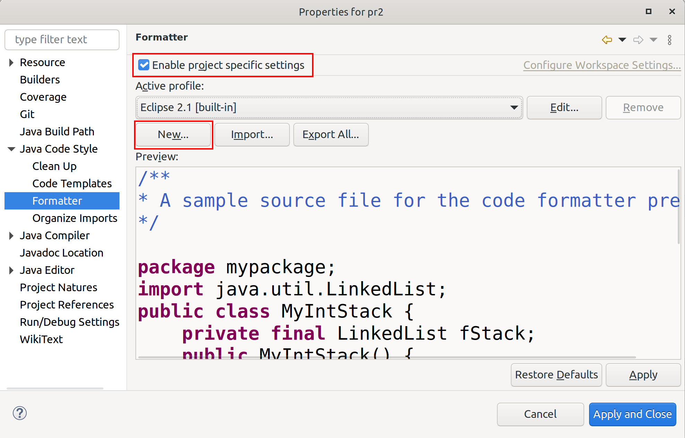
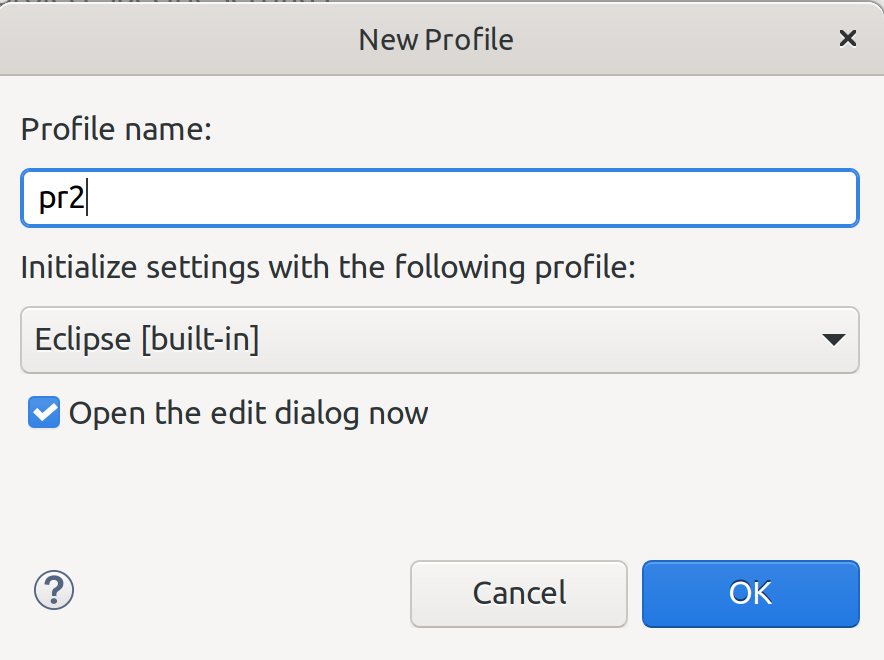
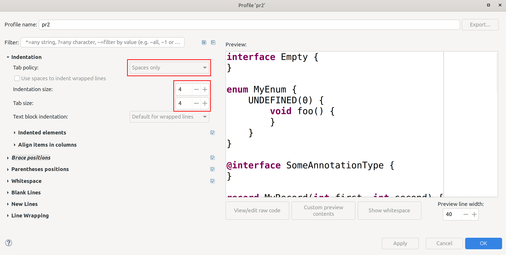
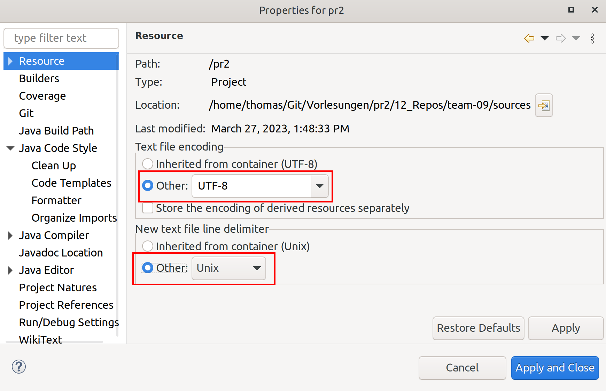

## Workspace und Projekt einrichten

Hier erhalten Sie eine Anleitung, wie Sie Eclipse für die Bearbeitung der Aufgaben einrichten.

  1. Legen Sie einen neuen Workspace für die Vorlesung PR2 an. Es empfiehlt sich, diesen in einem Unterverzeichnis, z.B. `eclipse-workspace` in Ihrem Working Directory anzulegen. Allerdings sollten Sie das Verzeichnis dann über die `.gitignore`-Datei von der Versionsverwaltung ausschließen. Auf keinen Fall sollten Sie den Workspace mit unter die Versionsverwaltung stellen.
  2. Erzeugen Sie mit `File` -> `New` -> `Java Project` ein neues Java-Projekt.
     * Geben Sie dem Projekt einen beliebigen Namen, z.B. "pr2"
     * _Entfernen_ Sie das Häkchen für `Use Default Location` und tragen Sie den Pfad zu dem `sources`-Ordner in Ihrem Working Directory ein.
     * _Entfernen_ Sie das Häkchen für `Create module-info.java file`. (**Wichtig!!!!**)
     * Drücken Sie auf `Finish`.

Wenn alles richtig funktioniert hat, findet Eclipse die Datei `.classpath` im `sources`-Verzeichnis und macht automatisch die notwendigen Einstellungen. Überprüfen Sie aber die folgenden Punkte trotzdem und passen Sie sie gegebenenfalls an.

  1. Gehen Sie auf die Projekteigenschaften (`Properties`), wählen Sie `Java Build Path` und dann die Registrierkarte `Libraries`. Selektieren Sie den `Classpath`.
      * Gehen Sie auf den Knopf `Add Library` und wählen Sie `JUnit` aus. Im folgenden Dialog selektieren Sie die Version 5 von JUnit.
  2. Gehen Sie auf die Projekteigenschaften (`Properties`), wählen Sie `Java Build Path` und dann die Registrierkarte `Source`.
      * Stellen Sie sicher, dass der Ordner `src/main/java` eingetragen ist.
      * Stellen Sie sicher, dass der Eintrag `Default output folder` `.../target/classes` entspricht.

## Tabs in Eclipse

Eclipse verwendet standardmäßig Tabulatoren für die Einrückung von Quelltexten. Da dies aber dem Coding-Standard widerspricht und auch von den Check-Tools bemängelt wird, sollten Sie Eclipse entsprechend konfigurieren.

Öffnen Sie die Properties für das aktuelle Projekt über `File` -> `Properties`.

Wählen Sie im Dialog die Option `Java Code Style` und dann `Formater`. Setzen Sie das Häkchen bei `Enable project specific settings` und klicken Sie auf `New`.

Geben Sie dem Profil einen Namen, z.B. `PR2`.

Wählen Sie unter dem Punkt `Indentation` als `Tab policy` den Eintrag `Spaces only` uns setzen Sie die Breiten auf jeweils `4`.

Schließen Sie den Dialog mit `OK` und das Properties-Fenster mit `Apply and Close`.

## Encoding und Zeilenende

Eclipse verwendet teilweise ein anderes Encoding als UTF-8 und benutzt Windows-Zeilenenden. Um dies zu verhindern nehmen Sie bitte folgende Einstellung vor:

Öffnen Sie die Properties für das aktuelle Projekt über `File` -> `Properties`.

Wählen Sie im Dialog die Option `Resources`.

Setzen Sie die Option `Text file encoding` auf `UTF-8` und `New text file line delimiter` auf `Unix`.
